# NEAR Catalyst Framework - Agentic Data Flow

## 🎯 System Overview

Our system implements an **8-agent swarm** that collaboratively discovers hackathon catalyst opportunities. Each agent has a specialized role and operates with specific data inputs/outputs to identify co-creation partners that unlock developer potential during NEAR hackathons and developer events.

## 🔄 High-Level Data Flow

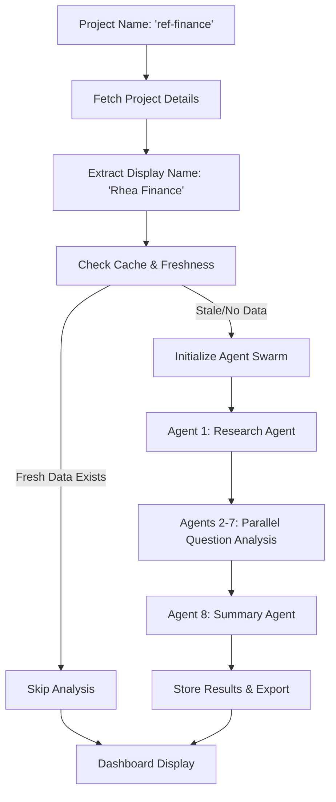

## 📊 Detailed Agentic Flow

### Phase 1: Project Initialization & Data Extraction

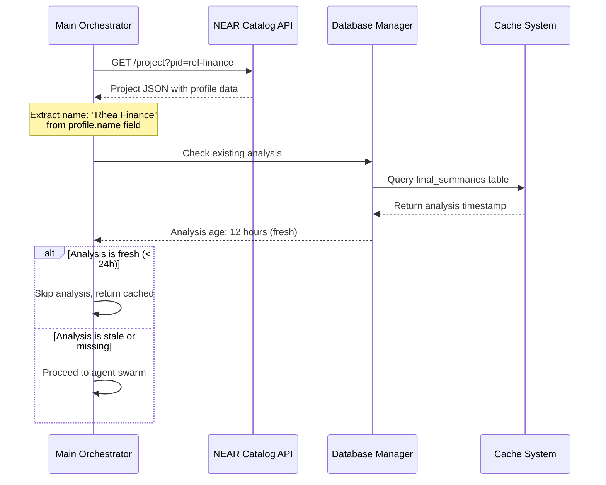

### Phase 2: Multi-Agent Swarm Initialization

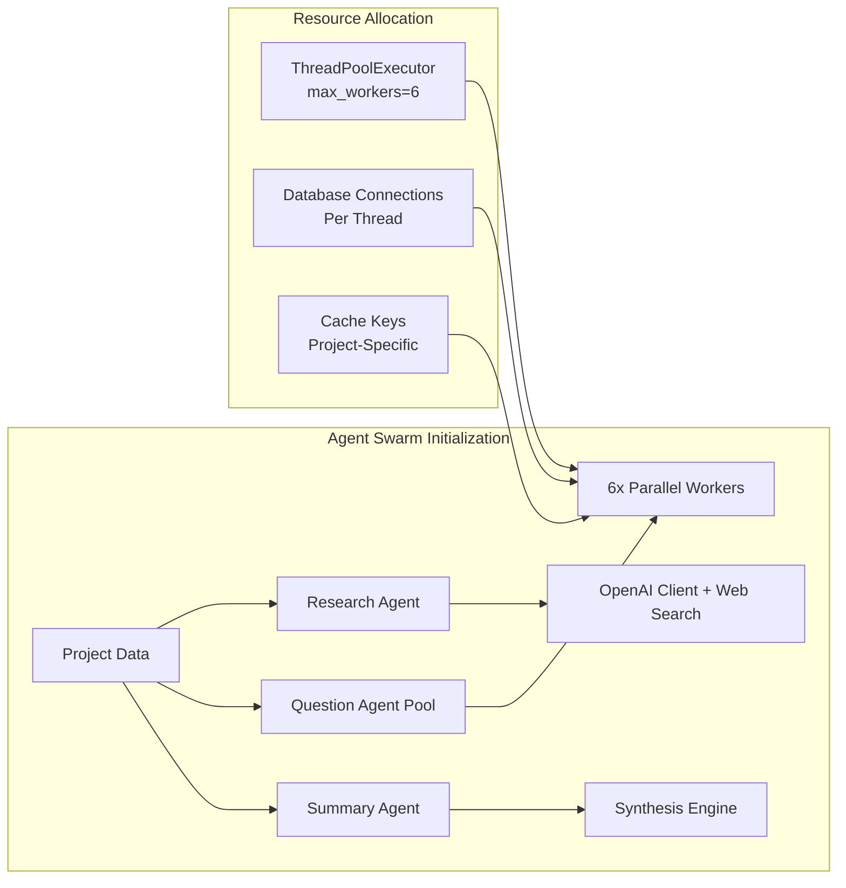

### Phase 3: Agent 1 - Research Agent Deep Dive

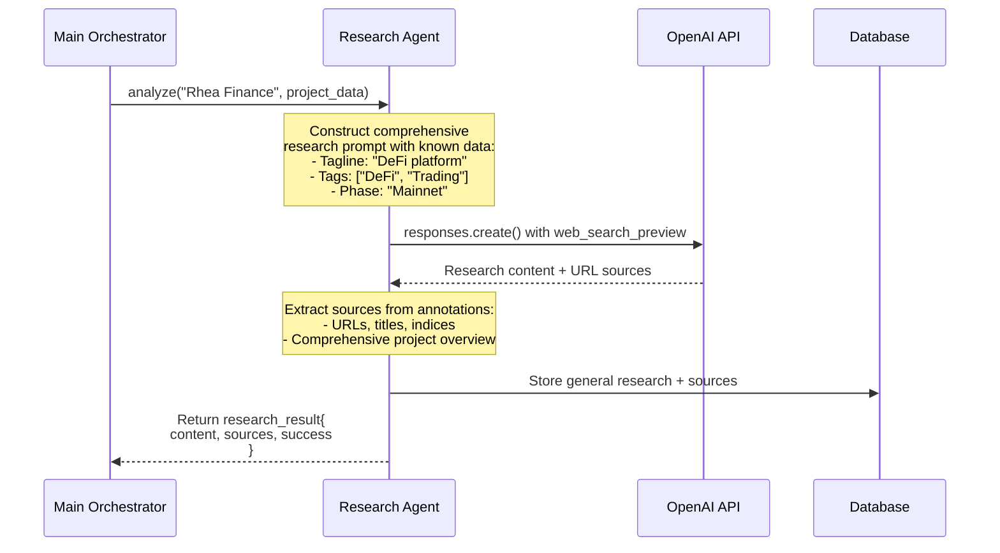

### Phase 4: Agents 2-7 - Parallel Question Analysis Swarm

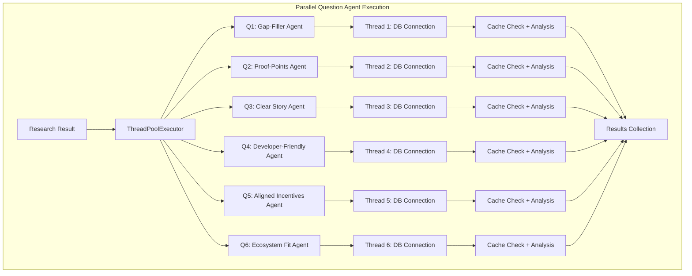

#### Individual Question Agent Flow

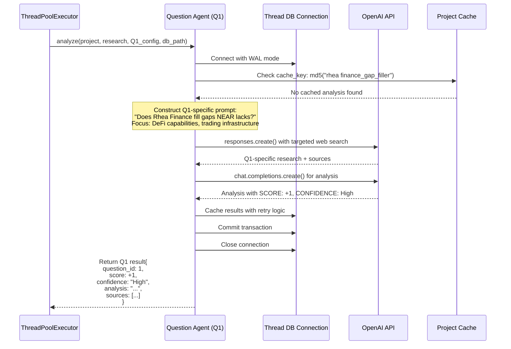

### Phase 5: Parallel Execution Coordination

```mermaid
gantt
    title Question Agent Execution Timeline
    dateFormat X
    axisFormat %s
    
    section Agent Execution
    Q1 Gap-Filler      :active, q1, 0, 35s
    Q2 Proof-Points    :active, q2, 0, 32s
    Q3 Clear Story     :active, q3, 0, 28s
    Q4 Developer-Friendly :active, q4, 0, 40s
    Q5 Aligned Incentives :active, q5, 0, 30s
    Q6 Ecosystem Fit   :active, q6, 0, 38s
    
    section Results Collection
    Sort by Question ID :milestone, 42s, 0s
    Validation Complete :milestone, 43s, 0s
```

### Phase 6: Agent 8 - Summary Agent Synthesis

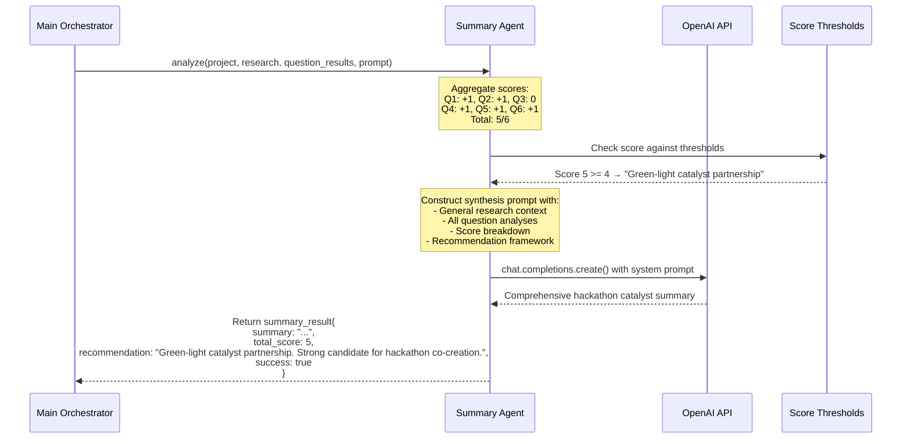

### Phase 7: Data Persistence & Export Pipeline

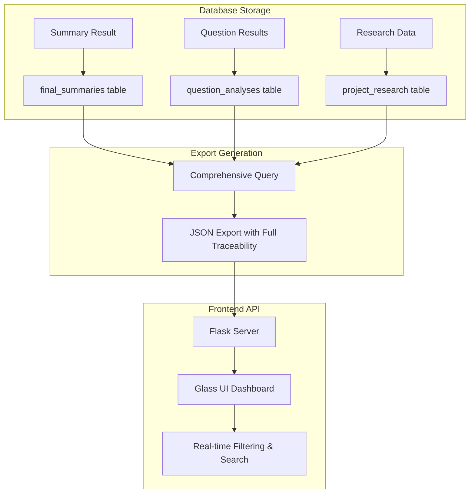

## 🔄 Cache Management & Data Poisoning Prevention

```mermaid
graph LR
    subgraph "Project-Specific Caching"
        A[Project: "Rhea Finance"] --> B[Question: "gap_filler"]
        B --> C[Generate Cache Key]
        C --> D[MD5: "rhea finance_gap_filler"]
        D --> E[Unique Cache Entry]
    end
    
    subgraph "Different Project"
        F[Project: "NEAR Intents"] --> G[Question: "gap_filler"]
        G --> H[Generate Cache Key]
        H --> I[MD5: "near intents_gap_filler"]
        I --> J[Separate Cache Entry]
    end
    
    E -.-> K[No Data Contamination]
    J -.-> K
```

## ⚡ Performance Optimizations

### Thread-Safe Database Operations

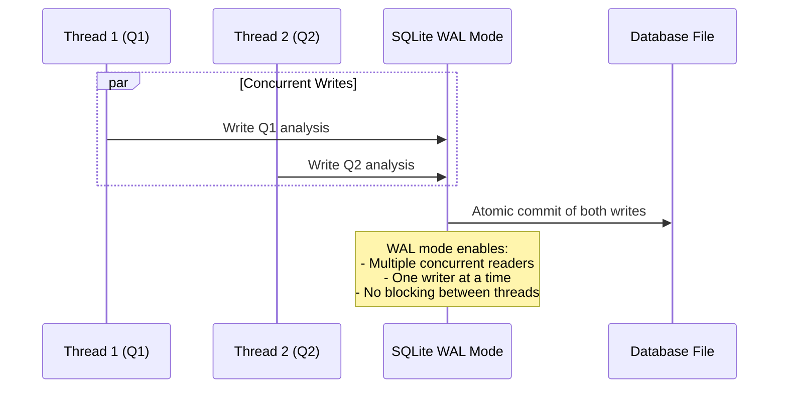

### Error Handling & Retry Logic

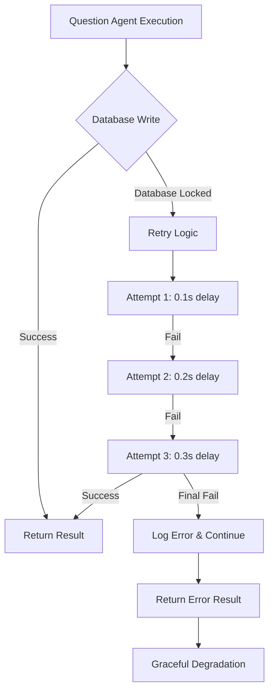

## 📊 Data Structures & Interfaces

### Question Agent Result Format

```json
{
  "question_id": 1,
  "research_data": "Comprehensive research about DeFi gaps...",
  "sources": [
    {
      "url": "https://rhea.finance/docs",
      "title": "Rhea Finance Documentation",
      "index": 1
    }
  ],
  "analysis": "ANALYSIS: Rhea Finance provides sophisticated DeFi trading tools that NEAR currently lacks...\nSCORE: +1 (Strong Yes)\nCONFIDENCE: High",
  "score": 1,
  "confidence": "High",
  "cached": false
}
```

### Final Summary Export Format

```json
{
  "project_name": "Rhea Finance",
  "slug": "ref-finance",
  "total_score": 5,
  "recommendation": "Green-light catalyst partnership. Strong candidate for hackathon co-creation.",
  "general_research": "Comprehensive overview...",
  "general_sources": [...],
  "question_analyses": [
    {
      "question_id": 1,
      "question_key": "gap_filler",
      "analysis": "...",
      "score": 1,
      "confidence": "High",
      "sources": [...]
    }
  ],
  "final_summary": "Hackathon catalyst discovery summary...",
  "created_at": "2024-01-15T10:30:00"
}
```

## 🎯 Agent Communication Patterns

### Stateless Agent Design

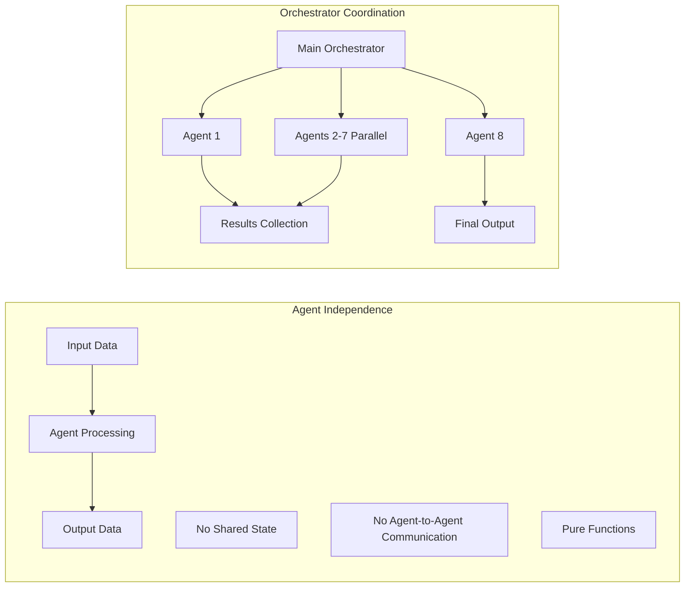

### Error Propagation & Graceful Degradation

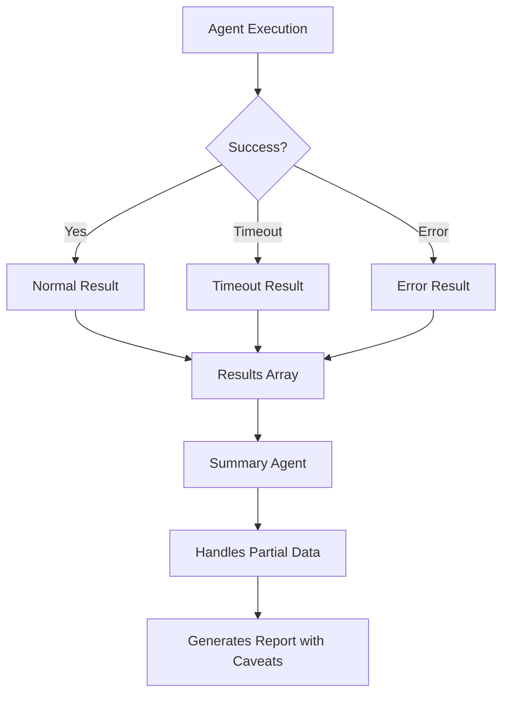

This agentic swarm architecture ensures **fault tolerance**, **performance optimization**, and **comprehensive analysis** while maintaining **data integrity** and **traceability** throughout the entire pipeline.

---

**Key Innovation**: The system transforms a single complex analysis task into a coordinated swarm of specialized agents, each optimized for specific aspects of partnership evaluation, resulting in more thorough, faster, and more reliable assessments. 